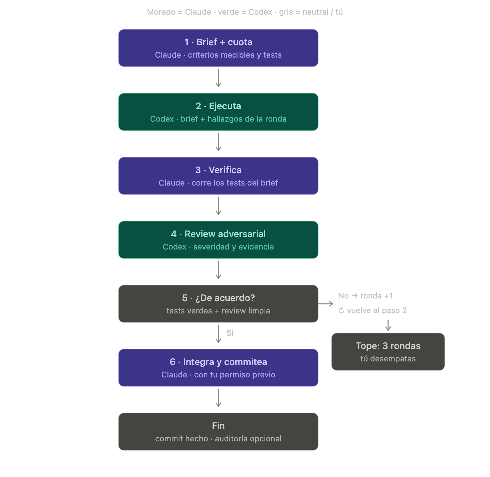

# HalJordan & Muad'Dib

Dos skills para auditar repositorios y coordinar el trabajo entre Codex (HalJordan) y Claude Code (Muad'Dib). Claude Code planifica, delega y verifica; Codex ejecuta y hace revisiones independientes. Tú tomas las decisiones.

## Skills

- [Engineering audit HalJordan–Muad'Dib v3](<Engineering audit haljordan muaddib-v3/skills/engineering-audit-haljordan-muaddib/SKILL.md>): auditoría de arquitectura, calidad, seguridad y pruebas. Genera reportes en Markdown con hallazgos priorizados y citas verificadas, sin modificar el código del proyecto.
- [Collab HalJordan–Muad'Dib v4](<Collab haljordan muaddib-v4/skills/collab-haljordan-muaddib/SKILL.md>): coordinación diaria entre Claude Code y Codex: delegación de tareas, revisión independiente, consulta de cuotas y traspasos de trabajo.

Cada skill incluye instrucciones en `SKILL.md`, plantillas y referencias en `references/` y utilidades en `scripts/`. Consulta el `SKILL.md` correspondiente para ver el flujo de uso.

## Flujo de colaboración

